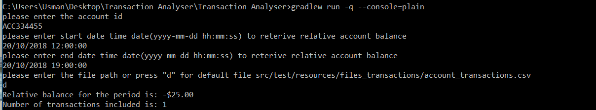

## Purpose

It provide the relative account balance of the account based on the following criteria

- account ID
- start date
- end date

## Requirements

The requirements are based on [this pdf](./ME - API team code challenge.pdf) file.
## Prerequisites
Java 1.8

## Design

Please refer to this flow chart for design

[Flow Chart](./design/flowchart/transaction_processing_flow.png)

## How to run application and provide input

on the root folder run the following command

```
gradlew run -q --console=plain
```

Refer to the below Image It will ask for the the following values 

- account id
- start date
- end data
- file path (provide the full path or enter "d" which will load the file from default location



## How to read the output
Based on the file and criteria programs will execute and provide the following output

- Relative account balance of the account
- Number of transactions

Please refer to above image

##Running the tests

```
gradlew test --rerun-tasks
```

## Notes:
Performance Consideration
- I did some performance testing and find out that using java streams reading the 100MB will take around 800ms. Multithreading/parallel processing can also be used in case of big files.

- The given solution fits for small size data, if the files are multiple and big like 10gb to 1tb then batch frameworks like Spring batch framework will be better fit.
- If the data is in multiple files and really big > 1tb then map reduce or apache spark will fit in better


## TODO:
- Increase the unit test coverage
- Benchmark the performance on different data size
- Add class diagrams and other related designs
- Add more comments to the code
- Add the code quality tools and evaluate on build


